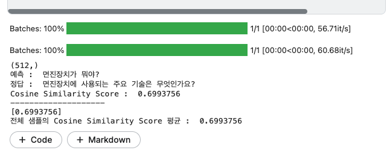
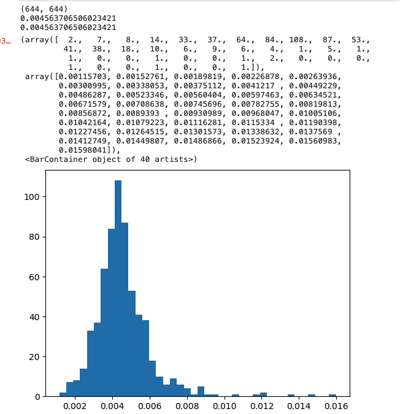
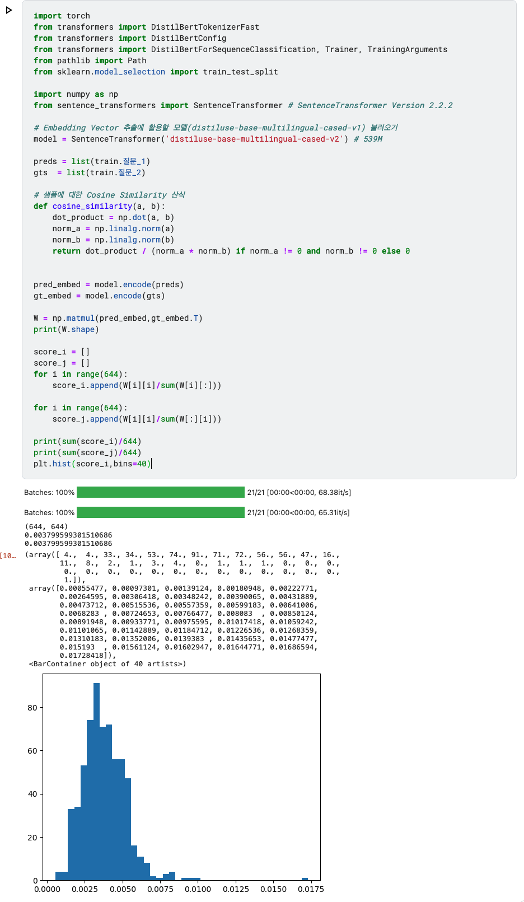
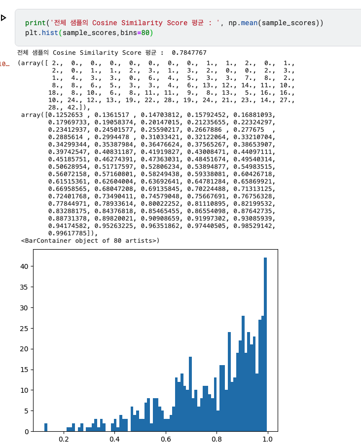
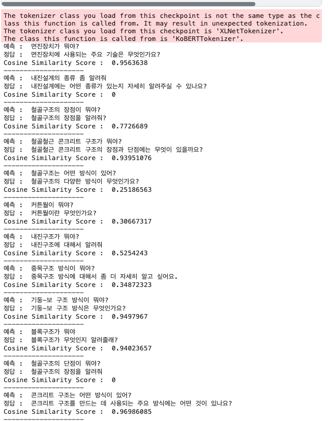
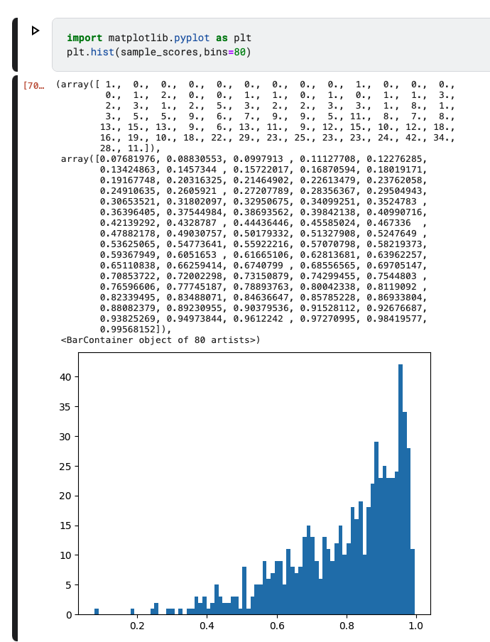
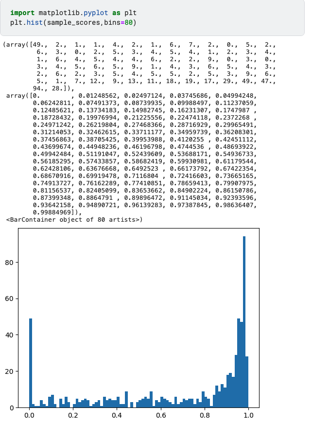

# bert q1,q2 비교

# 베이스 bert 


```bash
pip install -q sentence-transformers
```
```python
# 같은 piar 유사도 구하기 : v1평균 값 : 0.79386
# 같은 piar 유사도 구하기 : v2평균 값 : 0.78478
# 전체 샘플의 Cosine Similarity Score 평균 :  0.79386
import torch
from transformers import DistilBertTokenizerFast
from transformers import DistilBertConfig
from transformers import DistilBertForSequenceClassification, Trainer, TrainingArguments
from pathlib import Path
from sklearn.model_selection import train_test_split

import numpy as np
from sentence_transformers import SentenceTransformer # SentenceTransformer Version 2.2.2

# Embedding Vector 추출에 활용할 모델(distiluse-base-multilingual-cased-v1) 불러오기

model = SentenceTransformer('distiluse-base-multilingual-cased-v2') # 539M

model = SentenceTransformer('distiluse-base-multilingual-cased-v1') # 539M


# 문장 예시
preds = [
    "이번 경진대회는 질의 응답 처리를 수행하는 AI 모델을 개발해야합니다.",
    "데이콘은 플랫폼입니다."
]

gts = [
    "이번 경진대회의 주제는 도배 하자 질의 응답 AI 모델 개발입니다.",
    "데이콘은 국내 최대의 AI 경진대회 플랫폼입니다."
]

preds = list(train.질문_1)
gts  = list(train.질문_2)

# 샘플에 대한 Cosine Similarity 산식
def cosine_similarity(a, b):
    dot_product = np.dot(a, b)
    norm_a = np.linalg.norm(a)
    norm_b = np.linalg.norm(b)
    return dot_product / (norm_a * norm_b) if norm_a != 0 and norm_b != 0 else 0

sample_scores = []
for pred, gt in zip(preds, gts):
    # 생성된 답변 내용을 512 Embedding Vector로 변환
    pred_embed = model.encode(pred)
    gt_embed = model.encode(gt)
    
    print(gt_embed.shape)
    sample_score = cosine_similarity(gt_embed, pred_embed)
    # Cosine Similarity Score가 0보다 작으면 0으로 간주
    sample_score = max(sample_score, 0)
    print('예측 : ', pred)
    print('정답 : ', gt)
    print('Cosine Similarity Score : ', sample_score)
    print('-'*20)
    
    sample_scores.append(sample_score)

print(sample_scores)
print('전체 샘플의 Cosine Similarity Score 평균 : ', np.mean(sample_scores))

```



#### 추가적으로 얼마나 서로 uniformity하게 임베딩이 구성되어 있는지 확인해 보았다. uniformity할 수록 다음 계산되는 값이 높길 바라는것이다.

```python
pred_embed = model.encode(preds)
gt_embed = model.encode(gts)

W = np.matmul(pred_embed,gt_embed.T)
print(W.shape)

score_i = []
score_j = []
for i in range(644):
    score_i.append(W[i][i]/sum(W[i][:]))

for i in range(644):
    score_j.append(W[i][i]/sum(W[:][i]))
    
print(sum(score_i)/644)
print(sum(score_j)/644)
plt.hist(score_i,bins=40)
```


평균 0.004 이므로 아쉬웠다. 물론 비슷한 쿼리가 존재를 많이 하겠지만, 그래도 이렇게 낮길 바라진않았다. 왜냐하면 1/664를 하면 0.0015이라 그렇게 높지 않다고 생각이 든다.

## version2도 살펴보았다.


어떻게 multilingual 모델에서 적절하게 uniformity, alignmnet를 구성하였을지 궁금했다.


---
---

# skt/kobert-v1

```bash
pip install 'git+https://github.com/SKTBrain/KoBERT.git#egg=kobert_tokenizer&subdirectory=kobert_hf'
```

```python
# 단순 유사도 구하기 : base-encoder 값 : 0.7939
# skt/kobert  : 0.6921 - 0인 값들을 빼도 0.74 많이 부족함..

# 전체 샘플의 Cosine Similarity Score 평균 :  0.79386
import torch
from transformers import DistilBertTokenizerFast
from transformers import DistilBertConfig
from transformers import DistilBertForSequenceClassification, Trainer, TrainingArguments
from pathlib import Path
from sklearn.model_selection import train_test_split

import numpy as np
from sentence_transformers import SentenceTransformer # SentenceTransformer Version 2.2.2

# Embedding Vector 추출에 활용할 모델(distiluse-base-multilingual-cased-v1) 불러오기
model = SentenceTransformer('distiluse-base-multilingual-cased-v1') # 539M


from kobert_tokenizer import KoBERTTokenizer
from transformers import BertModel

tokenizer = KoBERTTokenizer.from_pretrained('skt/kobert-base-v1')
tokenizer.encode("한국어 모델을 공유합니다.")
#[2, 4958, 6855, 2046, 7088, 1050, 7843, 54, 3]
model = BertModel.from_pretrained('skt/kobert-base-v1')


preds = list(train.질문_1)
gts  = list(train.질문_2)

# 샘플에 대한 Cosine Similarity 산식
def cosine_similarity(a, b):
    dot_product = np.dot(a, b)
    norm_a = np.linalg.norm(a)
    norm_b = np.linalg.norm(b)
    return dot_product / (norm_a * norm_b) if norm_a != 0 and norm_b != 0 else 0

sample_scores = []
for pred, gt in zip(preds, gts):
    # 생성된 답변 내용을 512 Embedding Vector로 변환
    
    inputs = tokenizer.batch_encode_plus([pred])
    out = model(input_ids = torch.tensor(inputs['input_ids']),
              attention_mask = torch.tensor(inputs['attention_mask']))
    
    pred_embed = out.pooler_output.detach().numpy().reshape(-1)
    
    
    inputs = tokenizer.batch_encode_plus([gt])
    out = model(input_ids = torch.tensor(inputs['input_ids']),
              attention_mask = torch.tensor(inputs['attention_mask']))
    gt_embed =  out.pooler_output.detach().numpy().reshape(-1)
    
    sample_score = cosine_similarity(gt_embed, pred_embed)
    # Cosine Similarity Score가 0보다 작으면 0으로 간주
    sample_score = max(sample_score, 0)
    print('예측 : ', pred)
    print('정답 : ', gt)
    print('Cosine Similarity Score : ', sample_score)
    print('-'*20)
    
    sample_scores.append(sample_score)
print(sample_scores)
print('전체 샘플의 Cosine Similarity Score 평균 : ', np.mean(sample_scores))
```




## skt/kobert uniformity

```python
from tqdm import tqdm
from kobert_tokenizer import KoBERTTokenizer
from transformers import BertModel

tokenizer = KoBERTTokenizer.from_pretrained('skt/kobert-base-v1')

def encode_texts(texts, max_length=512):
    all_encodings = torch.tensor([])
    for text in tqdm(texts):
        try:
            # Ensure consistent sequence length across all texts
            inputs = tokenizer.batch_encode_plus(
                [text], max_length=max_length, padding='max_length', truncation=True
            )

            out = BertModel.from_pretrained('skt/kobert-base-v1')(
                input_ids=torch.tensor(inputs['input_ids']),
                attention_mask=torch.tensor(inputs['attention_mask']),
            )

            # Store either pooler output or desired intermediate layer's output
            encoding = out.pooler_output.detach().numpy().reshape(-1)
            all_encodings = torch.concat((all_encodings,encoding),dim=0)
        except ValueError as e:
            print(f"Error encoding text: {text}")
            print(e)

    return all_encodings

# Example usage
encodings = encode_texts(preds)
print(encodings.shape)
encodings2 = encode_texts(gts)


W = pred_embed@gt_embed.T
print(W.shape)

score_i = []
score_j = []
for i in range(644):
    score_i.append(W[i][i]/sum(W[i][:]))

for i in range(644):
    score_j.append(W[i][i]/sum(W[:][i]))
    
print(sum(score_i)/644)
print(sum(score_j)/644)
plt.hist(score_i,bins=40)
```

## 유사도 비교 결과.





 multi lingual이 더 좋은 우수한 결과라고 생각된다.


 ## PEFT LoRA 라이브러리 오류 발생
## 직접 만들기로 결심

# 1. 내가 LoRA를 적용하고 싶은 여러 모델 탐색

SentenceTransformer 중 multilingual,

clip,gpt2,bert를 lora를 사용해서 파인튜닝 시키고 싶었다.

mistral 7B, stable-diffusion은 불러오다가 오류가 나서 잠깐 보류

일단 논문에 나온대로 attention layer에다가 low rank adaptation을 하기로 생각.

gpt와 오피셜 깃허브의 힘을 받아서 만들어보았다.
12시간 넘게 걸린것 같다.

https://github.com/microsoft/LoRA/blob/main/loralib/layers.py

그러던 와중 수종이에게 감사하게도 v100을 빌려줘서 빠르게 만들었지만, 기본적인 코드에 대한 이해가 부족하다는 생각이 많이 든다.

먼저 코드를 해설하자면 LoRA_Config를 만들어서 config값을 받고, 
그걸로 기본 LoRALayer를 만들게 한다. 솔직히 잘몰라서 nn.Module을 상속받게 하고 만들면 어떻게든 학습되고 합쳐지지않을까했다.

각 LoRALayer는 기존 layer값과 config값을 받는다.

그후에는 lora_a,lora_b를 만들고 초기화 시킨다. 공식깃허브대로함.
그리고 dropout은 작동할수도 안할수도있어서 0이상인 경우에만 작동하고 아니면
lambda x :x로 지나가게 만들었다. 이건 공식 깃허브 보고안거임

그다음에 weight값을  scaling을 해주고 기존 가중치 값과 합친다음에

F.linear(x,W,bias)이렇게 만들었다. 이 구조는 직접적인 선형변환을 적용하기 위해서 추가한것이다. lowrank를 넣어주기위해 새로운 w를 구하고 그걸 다시 모델이 nn.linear로 인식해서 통과하도록 만들었다.

그리고 model에 표시되게

__repr__을 만들어주었다.

그리고 여러 모델들에 적용할수있나 확인해보았는데 잘되었다.
gpt2,distilbert,bert,xclip,clip,sentence-transformers/distil-multigual-encoder ....

일단 gpt,bert두개는 attention 레이어가 쿼리키벨류 3개가 합쳐져있어서 내가 그걸 적용하지는 못하였다. 파티션3개로 나눠서 해야한다.

다음 성능.현재까지 2000여개의 이미지와 텍스트 파일인 
youtube thumbnail의 데이터로만 관측한 결과 
rank값이 많아질수록 더 높은 성능을 보이고 있다. 최적화된 rank가 몇인지는 더살펴보아야할것같다.

어느순간부터 더 늘려도 안되는 순간이 오지않을까?

lora에 대해서 생각해보면 기존 벡터를 쿼리 키 벨류로 isomorphic하게 선형변환을 시킨다고 생각이든다. 그런데 lora는 projection시켜서 주요한 차원으로 압축시키고, 그걸 다시 원래의 차원으로 확장시킨다. 먼저 요지는 주요한 차원이 있다는것이다.
그걸 rank로 만들수있다는것이고, 그걸 다시 적절하게 만드느것이다.